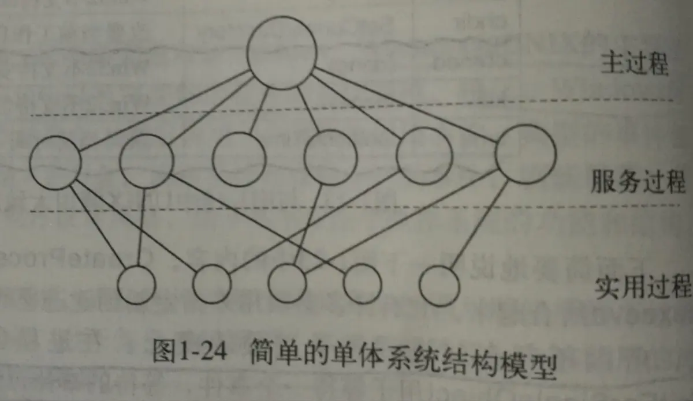
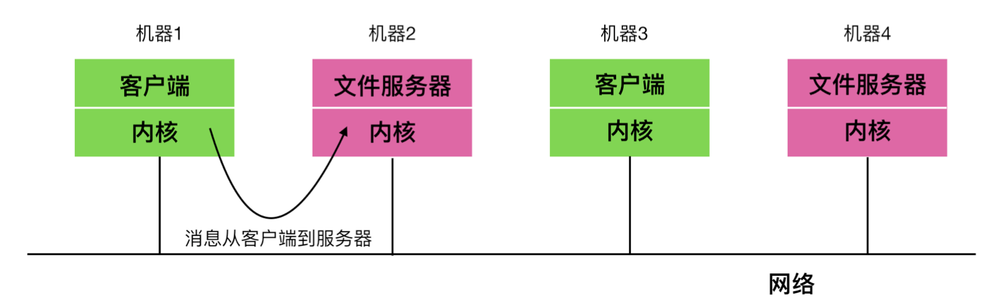

操作系统的几种结构，主要包括`单体结构`、`分层结构`、`微内核`、`客户-服务端系统`、`虚拟机`和`外核`等。

#### 单体结构

目前的大多数操作系统中，整个系统在内核态都以单一程序的方式运行。整个操作系统是以程序集合来编写的，链接在一块形成一个大的二进制可执行程序。使用此技术时，如果系统中的每个过程都提供了前者需要的一些有用的计算，则它可以自由调用任何其他过程。

在单体系统中，`调用任何一个所需要的程序会非常高效`，但是上千个不受限制的彼此调用则会非常臃肿和笨拙，而且单体系统`只要发生故障，那么renew系统和应用程序都会不可用`。

在单体系统中构造实际目标程序时，会首先编译所有单个过程(或包含这些过程的文件)，然后通过`系统链接`程序将单个程序链接成单一的目标文件。

单体结构中，也存在一些结构可以将参数设置在合适的已定义的位置(如`栈`)，通过预定义的方式，向操作系统请求所能提供的服务(`系统调用`)，然后执行一个陷阱指令(指将系统从用户态切换到内核台所进行的指令，陷阱指内陷到操作系统内核中)。

对于单体系统的基本结构，往往有以下几种建议：

- 需要有一个主程序，用来`调用请求`服务程序
- 需要有一套服务过程，用来执行`系统调用`
- 需要有一套服务程序，用来`辅助服务过程调用`

在单体系统中，对于每个系统调用都会有一个服务程序来保障和运行。需要一组实用程序来弥补服务程序需要的功能，例如从用户程序中获取数据。如下为单体系统的三层结构模型：



除了在系统最初启动时所装载的核心操作系统，许多操作系统支持可装载的扩展。例如：I/O设备驱动和文件系统。在Unix中被称作`共享库(Shared Library)`，在windows中则被称为`动态链接库(Dynamic Link Library, DLL)`。

#### 层次式系统

分层系统实用`层`来分隔不同的功能单元。`每一层只与该层的上层和下层通信，每一层都使用下面的层来执行其功能`。层之间的通信通过预定义的固定接口通信。



把单体系统进一步通用化，就会变成一个层次式结构的操作系统，层次式系统的上层软件都是在下层软件的基础上构建的，该系统分为六层，它是一个简单的批处理操作系统，如下：

| 层号 | 功能                     |
| ---- | ------------------------ |
| 5    | 操作员                   |
| 4    | 用户程序                 |
| 3    | 输入/输出管理            |
| 2    | 操作员-进程通信          |
| 1    | 存储器和磁鼓管理         |
| 0    | 处理器分配和多道程序编程 |

`第0层`：处理器在0层运行，当终端发生或定时器到期时，由该层完成进程切换；在第0层之上，系统由一些连续的进程组成，编写这些进程时不用在考虑在单处理器上多进程运行的细节。也就是说，第0层中提供了基本的CPU多道程序设计功能。

`第1层`：内存管理在该层，它分配进程的主存空间，当内存用完时，则在一个512k字的磁鼓上保留进程的一部分。在第一层上，进程不用考虑它是在磁鼓上还是在内存中运行。`第一层的软件保证一旦需要访问某一个页面，该页面必定已经在内存中，并且在页面不需要的时候将其移出`。

`第2层`：用来处理进程与操作员(用户)控制台之间的通信。可以理解每个进程都有自己的操作员控制台。

`第3层`：管理I/O设备和相关的信息流缓冲区。在第3层上，每个进程都与有与良好特性的抽象I/O设备活动，而不必考虑外部设备的物理细节。

`第4层`：用户程序层，用户程序不用考虑进程、内存、控制台或I/O设备管理等细节。

`第5层`：系统操作员进程。

#### 微内核

在分层式系统结构中，设计者要确定在哪里划分`内核-用户`的边界。传统上，所有的层都在内核中。事实上，尽可能减少内核态中功能的做法更好。因为内核中的错误很难处理，一旦内核态中出现错误会拖累整个系统。

所以，为了实现高可用性，将操作系统划分成小的，层级之间能够更好定义的模块是很有必要的，只有一个模块---微内核---运行在内核态，其余模块可以作为普通用户进程运行。由于把每个设备驱动和文件系统分别视作普通用户进程，这些模块中的错误虽然会使这些模块崩溃，但不会使整个系统死机。

`在单体系统中，所有的设备驱动都在内核中，一个有故障的音频驱动很容易引起对无效地址的引用，从而造成系统停机。`

`MINIX 3`是微内核的代表，它的具体结构如下

在内核的外部，系统构造有3层，都处于用户态下运行，最底层是设备驱动器。由于它们都在用户态下运行，所以不能物理访问I/O端口空间，也不能直接发出I/O命令。相反，`为了能对I/O设备编程，驱动器构建一个结构，指明哪个参数值写到哪个I/O端口，并声称一个内核调用`，这样就完成了一次调用过程。

位于用户态的驱动程序上面是`服务器层`，包含有服务器，它们完成操作系统的多数工作。由一个或多个文件服务器管理着文件系统，进程管理器创建、销毁和管理进程。服务器中有一个特殊的服务器称为`再生服务器(reincarnation server)`，它的任务就是检查服务器和驱动程序的功能是否正确，一旦检查出来错误，再生服务器就会补上去，无需用户干预。这种方式使得系统具有==可恢复性==，并具有较高的==可靠性==。

系统对每个进程的权限有着许多的限制。所有这些权限是让每个驱动和服务器只拥有完成其工作所需要的权限，这样就极大限制了故障部件对系统造成的危害。

微内核中的内核还具有一种`机制`与`策略`分离的思想。比如，`系统调度，一个比较简单的调度算法是对每个进程赋予一个优先级，并让内核执行具有最高优先级的进程`。这里，内核机制就是寻找最高的优先级进程并运行。而策略(赋予进程优先级)可以在用户态中的进程完成。在这种模式中，策略和机制是分离的，从而使内核变得更小。

#### 客户-服务器模式

微内核思想的略微变体是将进程划分为两类：`服务器`，每个服务器用来提供服务；`客户端`，使用这些服务。这个模式就是所谓的`客户-服务器`模式。

通常在系统最底层的是微内核，但并不是必须这样。这个模式的本质是存在客户端进程和服务端进程。

一般来说，客户端服务端之间的通信是“消息传递”。为了获得一个服务，客户端进程构造一段消息，说明需要的服务，并将其发送给合适的服务器，该服务器完成工作，发送回应。

客户-服务器模式会有两种载体，一种情况是一台计算机既是客户端又是服务端，在这种方式下，操作系统会有某种优化；但是普遍情况下客户端和服务端在不同的机器上，它们通过局域网或广域网连接。

由于客户端通过发送消息与服务器通信，客户端并不需要知道这些消息是在本地计算机上处理，还是通过网络被送到远程计算机上处理。对于客户端而言，这两种情形都是一样的：都是发送请求并得到回应。所以服务器客户端模式是一种可以应用在单机或网络机器上的抽象。（许多web就是以这个方式运行的），一台PC向某个服务器请求一个web页面，服务器吧web页面返回给客户端，这就是典型的客户-服务端模式。

