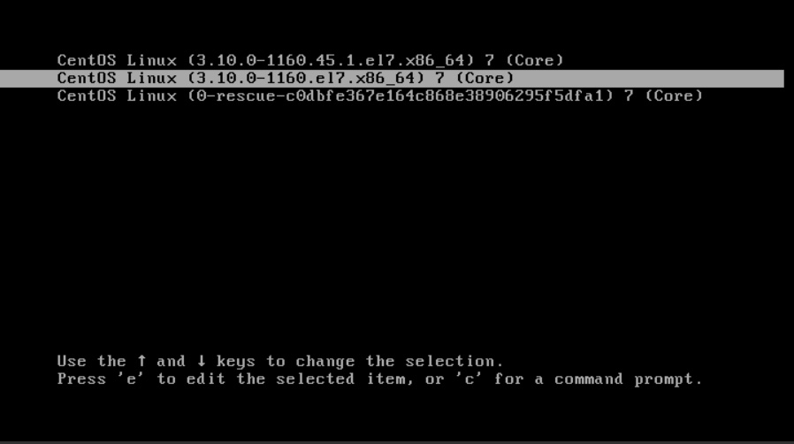

[toc]

前言

最近看了写了一篇关于计算机启动过程的博客，里面提到了关于 `启动管理器(grub)`，索性就再写一篇文章介绍 `grub` 是什么及工作原理。

1. ### 什么是grub？

   > Briefly, a boot loader is the first software program that runs when a computer starts. It is responsible for loading and transferring control to an operating system kernel software (such as Linux or GNU Mach). The kernel, in turn, initializes the rest of the operating system (e.g. a GNU system).

   通俗上来讲，`启动引导项(Boot Loader)` 是服务器开机启动后运行的第一个软件程序，主要用来加载、控制操作系统的内核和初始化启动硬盘，当加载了内核后，剩余的开机事项就会交付给  `操作系统内核` 来完成。

   因此，`启动引导项` 必须要能够访问到 `内核` 和 `initramfs镜像`，否则，操作系统将无法开机。

   而启动引导项中目前使用最普遍的则是 `grub` 和 `LILO(Linux Loader)` 。基本上 x86 系列的服务器都以 `grub` 作为启动引导项。那么， `grub` 是什么呢？

   `GUN GRUB(GRand Unified Bootloader，大一统启动加载器)` 是起源于`GUN`项目的`多操作系统启动程序`。`GRUB`是多启动规范的实现，它允许用户可以在计算机内同时安装多个操作系统，并在计算机启动时选择需要运行的操作系统。

   `grub` 强大之处在于，支持加载各种各样的操作系统，当操作系统开机到 `grub` 界面时，你可以根据自己的需要动态选择你希望运行的操作系统。

   

   如图，开机的过程中选择即将启动的操作系统

   `grub` 的另一个特性是 `灵活性`。`grub` 清楚文件系统和内核执行的方式，这使得你可以无须记录内核在硬盘上的位置而以你喜爱的方式引导任意的操作系统。例如，在启动时指定内核的名称和内核所在的驱动器和分区的位置，就可以通过 `grub` 加载内核来完成开机。

   

2. ### gurb的版本介绍

   `grub` 起源于1995年，由 Erich Boeyn 所编写的引导程序。经过一段时间的使用后，grub 中增加了许多新的特性和扩展，但 Erich 逐渐发现现有的grub的设计已经跟不上对grub的扩展，且很难在原有设计的基础上进行改造。

   2002年，Yoshinori K. Okuji 开始了对 grub 通用架构的改造工作，旨在重写grub的核心，使其更安全、干净、健壮和强大。这一项目被称为 `PUPA`，并在最终命名为 `grub2`，而 grub 的原始版本则重新命名为 `Grub Legacy`。

   到2009年，一些主要的发行版都默认安装了 `grub2`。

   尽管 `grub2` 是在 `grub` 的基础上开发出来的，但两个版本存在很多差异。

   - 配置文件由 `menu.lst` 变为 `grub.cfg`
   - 通过 `grub-mkconfig` 命令行工具可以生成 `grub.cfg` 配置文件
   - grub 设备中的分区号现在以1开始，而不是0
   - 配置文件的语法接近于一门完整的脚本语言，支持变量、条件分支和循环语法
   - 通过在grub中配置使用 save_env 和 load_env 可以在重启的过程中使用少量的信息持久化存储起来
   - grub2 对于寻找磁盘上的文件或在多磁盘上寻找对应的内核文件更加方便
   - 支持更多的文件系统，例如 ext4、NFFS
   - grub2 支持直接从 LVM 和 RAID 磁盘上读取数据
   - 支持图形终端和图形化系统菜单
   - grub2 的借口界面支持翻译，例如菜单条目名称
   - 组成 grub 的镜像文件被重新设计
   - Grub2 在动态加载的内核模块中加入了许多工具，允许核心镜像体积更小，且构建镜像变得更为灵活

3. ### grub的工作原理

