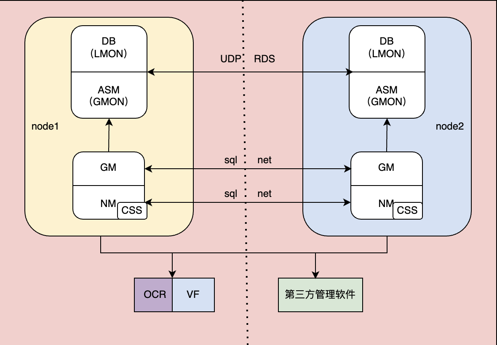

`CSS(Cluster Syncnorazation Service)` 是Oracle集群中至关重要的一个组件，主要用来完成集群的构建、和维护集群的一致性工作。`CSS` 的功能主要包含两个部分，`NM(Node Management)` 和 `GM(Group Management)`。也即是说，`CSS` 功能中的 **NM** 和 **GM** 都是用来构建集群和维护集群一致性的。  

> 集群一致性指的是集群中的每个成员能够了解其他成员的状态，而且每个节点中关于集群中其他节点的状态和集群中节点成员列表信息是一致的；集群一致性是对集群最基本的要求，一旦集群中的节点信息出现了不一致的现象，必须通过离线/重启的方式将不一致的节点驱逐出去

那么，`CSS` 是如何通过 **NM & GM** 来实现集群一致性的维护呢。

#### Node Management

`Node Management(节点管理)` 主要用来实现集群节点间的配置，包括节点启动ocssd、离线节点、节点重新配置等功能。在集群环境中，`NM` 首要解决的问题就是如何让集群中的节点处于一致性的状态，以及，当集群成员发生改变时，如何维护集群的一致性。

Oracle的 `Node Management` 通过 `网络心跳`、`磁盘心跳`、`本地心跳`、及 `集群重新配置` 这三种心跳机制实现对集群一致性的维护。

##### 网络心跳
`网络心跳(Network HeartBeat,NHB)` 用来探听节点间的联通性，以便节点间能够了解到其他节点的状态。**网络心跳** 是通过绑定在节点上的私有网络(集群内部网络)与集群其他节点进行通信，这个通信进程由 **ocssd** 守护进程来发起。  

对于Oracle集群来讲，**ocssd** 守护进程每秒会通过集群私网向集群中的其他节点发送网络心跳。当一个节点长时间(超过集群配置的网络超时时间后)没有接收到来自其他节点的网络心跳后，则会触发集群重新配置(Reconfiguration)。重新配置开始后，集群中的一个或多个节点会被驱逐出集群，等待节点恢复正常后再将节点重新配置到集群中(驱逐集群后,**ocssd**守护进程会不断探听离线节点的状态,以便在节点可用时恢复节点的服务)。

对于Oracle集群，集群重新配置发生时往往伴随以下事件
* 集群中一个节点连续一段时间内丢失网络心跳
* 集群中的主节点(一般是节点号小的那个节点)向集群中的所有节点发送重新配置的消息，所有节点会报告主节点自己节点当前的状态
* RM(Reconfiguration Master)主节点检查所有节点的状态，进行投票
* RM主节点通过检查无法访问网络心跳的节点的磁盘心跳，并判断是否会发生脑裂
* RM主节点向表决盘(Voting File)的 Kill Block中写入**(Poison Package,有毒数据)**，需要重启的节点在访问到表决盘的有毒数据时，触发节点的重启
* 重新配置开始后，RM主节点会修改集群中的成员列表信息(成员列表信息保存在表决盘中)，完成集群重新配置

##### 磁盘心跳
Oracle保证集群一致性的第二种机制为 `磁盘心跳(Disk HeartBeat,DHB)`。磁盘心跳的主要目的是当集群发生脑裂时，需要确定具体哪个节点可以存活，哪个节点需要离线重启的一种解决手段。

对于绝大多数场景下，仅仅只有 `网络心跳` 是不够的。当一个节点的网络出现问题时，集群中的一个或多个节点无法接受到其他节点的网络心跳，无法做出判断，哪个节点存活，哪个节点私网。因此，需要 `磁盘心跳` 来作为网络心跳不通时的另一个裁决手段。节点间的磁盘心跳每秒钟也会向集群的所有表决盘注册自己节点的状态，同时也会将自己节点能够正常通信的其他节点的成员信息写入到表决盘中。

这样，一旦集群间出现脑裂，CSS 可以根据表决盘中的信息了解每个节点的状态，以及节点与节点之间的连通情况对集群进行重新配置

##### 本地心跳
集群中的第三种心跳机制为 `本地心跳(Local HeartBeat,LHB)`，本地心跳的主要作用是监控本节点的 **ocssd.bin** 守护进程及本地节点的状态。

Oracle每秒钟在发送网络心跳的同时，也会向 **cssdagent** 和 **cssdmonitor** 进程发送本地节点 **ocssd** 进程的状态，如果本地节点的 **cssdagent** 进程可以收到本地心跳，则说明该节点的 **ocssd** 进程状态正常。

无论集群中的三种心跳机制，哪一种出现了问题，都会触发集群进行重新配置。而重新配置的结果，往往是一个或多节点的驱逐重启。

#### Group Management
Oracle `CSS` 功能的另一个组成部分为 `Group Management(组管理)`。组管理主要完成两部分的功能- `共享` 和 `隔离`。

集群环境中，出了节点之外，还有很多资源是以资源组的形式存在的，对于资源组的管理工作则由 `GM` 来完成。Oracle集群中，每个组中会包含若干个成员，每个组或组中的成员都要 **向外共享** 一些信息。

##### 共享
集群中的每个数据库都作为一个组注册到CSS上，而这个组的主要成员就是LMON进程，当LMON进程被启动的时候，需要把自己注册到CSS对应的组当中，CSS根据注册的组的数量进行判断当前集群中存在同时运行的数据库实例的个数，每个实例运行在哪个节点上，这种形式一般称为 `组内共享`。实现组内共享的组，其组内成员必须是同一个节点上的资源。

集群中ASM实例启动后，一些ASM实例的进程也会构成一个组并把自己注册到CSS上，同时把自己的信息共享出去，以便数据库实例能够发现运行的ASM实例，并进行通信，这种形式称为 `组间共享`。组间共享又称为全局共享，组成员来自不同的节点上，彼此之间通过RPC进行通信。

##### 隔离
组管理的另一个重要功能是 `隔离`。当组中的一个成员离开或加入的时候，`GM` 必须保证组成员对应的进程状态在OS级别已经释放，而且进程正在执行的所有I/O操作都被清理掉，并且不能产生新的I/O。因为对于集群来说，必须确保节点间I/O的一致性。

当组中的某个成员离开或加入组的时候，组层面也会有一个类似于 `NM` 中的重新配置主节点(Reconfiguration Master) 来完成组成员的重新配置，这个节点称为 `GM Master`。

在Oracle集群中，首先需要保证的就是节点或组之间的一致性，一旦集群中的节点或组出现问题后，CSS首先会通过NM进行重新配置，然后进行GM组层面的配置，并且当NM节点间的重新配置没有结束时，组层面的重新配置必须被suspend，这是因为集群必须先保证节点间的一致性，然后才能保证组层面的一致性。

参考: https://blogs.oracle.com/database4cn/post/css
