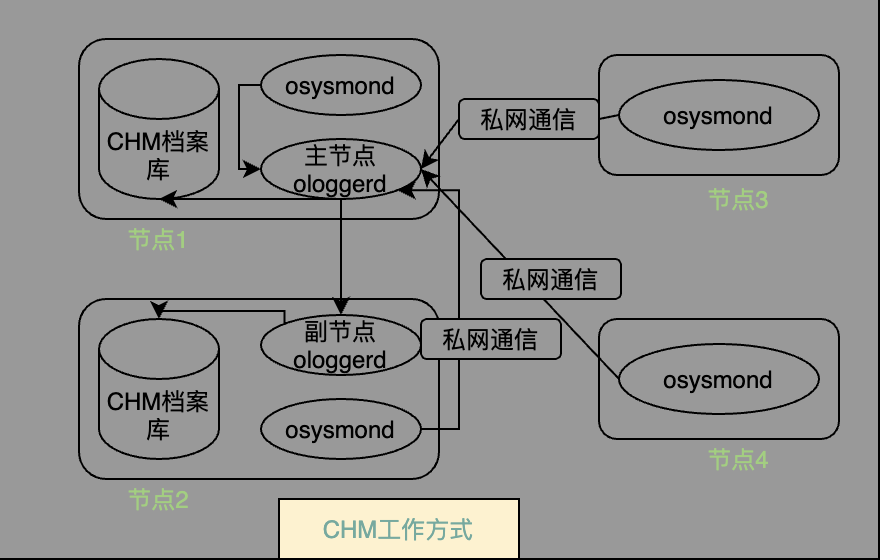

### Oracle OHAS
`OHAS(Oracle High Availability Service, 高可用服务)` 是Oracle 11gR2 版本中新增的一个重要组件，随着该组件的出现，Oracle集群管理软件在集群启动方式和资源管理方式上发生了很多变化。

#### 集群启动
Oracle 11g版本之前，集群主要通过 `/etc/inittab` 开机脚本中的命令进行集群的启动。而在11gR2版本中，Oracle推陈出新对Oracle体系结构做出了重大变更，推出了 **GI(Grid Infrastructure)** 架构，新架构保留了早期Oracle数据库的核心功能，但从集群层面，将CRS集群的结构拆分的更加精密，结构更加的标准，功能也越发强大。    

Oracle 11gR2版本中，所有的组件都以**资源**的形式存在于集群中，所有的资源统一由代理进程进行管理。所有的组件按照功能划分 **集群初始化组件**、**集群存储管理软件** 和 **应用程序组件**。  

**集群初始化软件** 主要负责完成集群的初始化工作。主要包括 **启动ohasd进程**、**bootstrap本地节点**、**启动ocssd**、**构建维护集群的一致性**。  
**集群存储管理软件** 主要负责管理集群的共享存储-**ASM磁盘组**。主要包括 **启动ASM实例**、**挂载ASM磁盘**、**管理ASM实例和磁盘组**。  
**应用程序组件** 主要负责管理集群中的应用程序资源。主要包括 **启动CRSD守护进程**、**通过OCR中的信息启动并管理集群中的所有应用程序资源**。  

在11gR2版本中，由于资源管理形态的变化，启动集群从 `/etc/inittab` 启动表中的 `/etc/init.d/init.cssd & /etc/init.d/init.crsd & /etc/init.d/init.evmd`启动变为从 `/etc/init.d/init.ohasd` 启动，集群中所有资源的启动都必须由**ohasd**拉起。也就是说，**ohasd**成为11gR2(及之后)版本集群启动的根(root)守护进程。  
集群启动后，可通过`ps -aux | grep ohasd` 查询对应的进程状态
```bash
$ps -aux | grep ohas
root       3892  0.0  0.0 115540  1660 ?        Ss   Feb11   0:00 /bin/sh /etc/init.d/init.ohasd run >/dev/null 2>&1 </dev/null
root      49208  0.0  0.0 112812   968 pts/0    R+   18:28   0:00 grep --color=auto ohas
```

##### ohasd启动步骤
**ohasd**主要负责集群初始化服务及启动代理进程，其启动步骤分为好几步
* 第一步，查找`/etc/init.d/ohasd.bin`文件是否存在
* 第二步，检查集群初始化所需要加载的配置信息是否正确。主要检查集群的`(OLR,本地注册表)`、ohasd启动所需要的scoket文件是否存在及ohasd对应的日志组是否可以正常访问
* 第三步，调用`/etc/init.d/ohasd.bin run`启动ohasd进程
* 第四步，ohasd进程启动成功后，开始启动负责集群初始化的代理进程，由代理进程启动集群初始化资源对应的进程。主要包含**oraagent**、**orarootagent**、**cssdagent**、**cssdmonitor**。
> 各个代理进程启动的集群资源  
**oraagent**: 负责启动**ora.asm**、**ora.evmd**、**ora.gipcd**、**ora.gpnpd**、**ora.mdnsd**  
**orarootagent**: 负责启动**ora.crsd**、**ora.ctssd**、**ora.cluster_interconnect**、**ora.crf**   
**cssdagent**: 负责启动**ora.cssd**  
**cssdmonitor**: 负责启动**ora.cssdmonitor**      
* 第五步，**oraagent**代理进程启动，启动**mdnsd**守护进程，并启动**mdns**服务
* 第六步，**mdnsd**守护进程和**mdns**服务启动后，接着启动**gpnpd**守护进程，**gpnpd**守护进程开始读取本地节点的gpnp profile，之后和集群中的远程节点的gpnpd守护进程进行通信，从而获取其他节点的gpnp profile；**gpnpd**守护进程启动成功后，会将读取到的gpnp profile共享给集群的其他节点用来初始化集群资源
* 第七步，**gpnpd**守护进程启动结束后，**gipcd**守护进程开始启动。**gipcd**守护进程启动后，会与**gpnpd**守护进程进行通信，并从**gpnpd**守护进程获取集群的私网网卡信息，并和集群远程节点的**gipcd**守护进程通信，通信结束后开始监控本地节点的私网状态
* 第八步，**cssdagent**守护进程开始启动，并启动对应的**ocssd.bin**守护进程；守护进程启动成功后，集群的所有资源(ora.ctssd、ora.crsd、ora.diskmon、ora.asm)开始启动 * 集群中的众多初始化资源需要依赖cssd服务 *
* 第九步，**cssdmonitor**守护进程开始启动，并监控**ocssd.bin**守护进程的状态

#### 集群资源管理
11gR2版本前，Oracle使用`CRS(Cluster Ready Service,集群ready服务)`来进行集群组件的管理，而伴随着11gR2版本中**GI**架构的出现，**ohasd**变为集群初始化的唯一始点，所有组件的守护进程和集群管理的资源统统被称为**资源**。  

由于11gR2版本中**组件**的形式变化为**资源**，因此在11gR2版本中推出了一个`集群注册表OLR(Oracle Local Registry)`用来保存集群中各种资源的属性。  

`OLR`是保存在集群节点本地的集群注册表，也就是说，**OLR**表中的信息多是针对本地节点的。**OLR**的主要功能为为**ohasd**守护进程提供集群的配置信息和初始化资源的定义信息，当集群启动时，**ohasd**会从`/etc/oracle/olr.loc`文件中读取**OLR**本地注册表的位置，并使用本地注册表中的信息来完成集群的初始化工作。  

Oracle 11gR2版本总另一个重要的特性则是`代理进程`。在11gR2版本之前，集群统一使用**组件**的形式管理和配置集群，但随着集群功能的不断完善，越来越多的组件应运而生，使得之前的集群管理方式无法满足复杂的资源管理任务。而在11gR2版本中，Oracle集群管理软件中通过引入**代理进程**来实现对资源的高效管理。  

**代理进程**以守护进程的形式存在，且代理进程属于多线程的进程，通常针对不同的资源会启动不同的代理进程。**代理进程**只能通过**ohasd**和**crsd**守护进程启动，其他进程无法启动代理进程。而**ohasd**守护进程启动的代理进程负责管理集群的初始化资源和其他守护进程，**crsd**守护进程启动的代理进程负责管理集群的其他资源。  

##### ohasd管理的资源
在11gR2版本中集群使用**ohasd**来作为集群的初始化启动工作后，**ohasd**同时兼具部分集群资源管理的功能，其中最重要的两个资源分别为**HAIP(High Availability IP, 高可用IP)**和**CHM(Cluster Healthy Monitor, 集群状态监控)**。

**HAIP**是Oracle针对私网的高可用特性和负载均衡特性推出的集群通信配置，使用Oracle的**HAIP**功能，需要在安装集群的过程中为集群的私网指定多块网卡。Oracle会自动在集群的每一块私网网卡上绑定一个**169.254.x.x**网段的IP地址，这个被绑定在网卡上用于集群私网通信的IP则被称为**HAIP**。  

当集群和数据库正常工作时，数据库实例和ASM实例将通过**HAIP**进行集群内部的通信，当集群中的一块私网网卡出现故障时，对应网卡上绑定的IP会自动漂移到其他的私网网卡上，从而实现集群内部私网通信的高可用特性。同时，集群内部存在一张以上的私网网卡时，每一块网卡都可以承担实例之间的通信，从而实现私网通信的负载均衡特性。  

**ohasd**管理的另一个资源为**CHM(集群状态监控)**，该资源主要用来自动收集操作系统资源(包含CPU、内存、进程、I/O及网络等)的统计信息。从11gR2版本开始，**集群状态监控**以初始化资源ora.crf的形式存在于集群的所有节点上。  
通过`crsctl stat res -t -init`查询可看到
```bash
$crsctl stat res -t -init
--------------------------------------------------------------------------------
Name           Target  State        Server                   State details
--------------------------------------------------------------------------------
Cluster Resources
--------------------------------------------------------------------------------
...
ora.crf
      1        ONLINE  ONLINE       com91                    STABLE

```

作为集群资源管理软件，**CHM**每隔数秒的时间收集一次集群的数据，具备非常高的实时性，通常**CHM**收集的系统资源数据对于集群故障诊断、节点重启、实例驱逐、性能问题的分析有重大帮助。  

**CHM**主要包含3个组件，分别为
* CHM档案库(Respository): 主要用来保存从集群各节点搜集到的操作系统统计信息
* 系统监控服务: 以osysmon.bin守护进程的方式在集群所有节点运行，osysmon.bin主要负责定期搜集本地节点的操作系统统计信息，并将信息发送给主节点的集群日志服务
* 集群日志服务(Cluster Logger Service): 以ologgerd守护进程的方式运行在集群的**CHM主节点(Master Node)**和**副节点(Replication Node)**上。主节点的ologgerd负责接收所有节点的osysmond.bin发送过来的操作系统信息，并记录到主节点的**CHM档案库**中；副节点的ologgerd负责接收从主节点的集群日志服务发送过来的操作系统统计信息，并记录到副节点的**CHM档案库**中。  

**CHM**的工作方式


* 第一步，集群中各个节点的osysmond通过集群私网向主节点的ologgerd发送本地节点的操作系统统计信息
* 第二部，主节点的ologgerd将接收的操作系统统计信息写入到本节点的CHM档案库中
* 第三步，主节点的ologgerd将信息通过集群私网发送到副节点的ologgerd，副节点将来自主节点的操作系统统计信息写入到副节点的CHM档案库中

如果在集群运行过程中，主节点出现故障，集群中副节点则会接管主节点的任务并成为新的主节点，新的主节点会根据集群其他节点的情况从集群中选择其他节点成为CHM的副节点。

