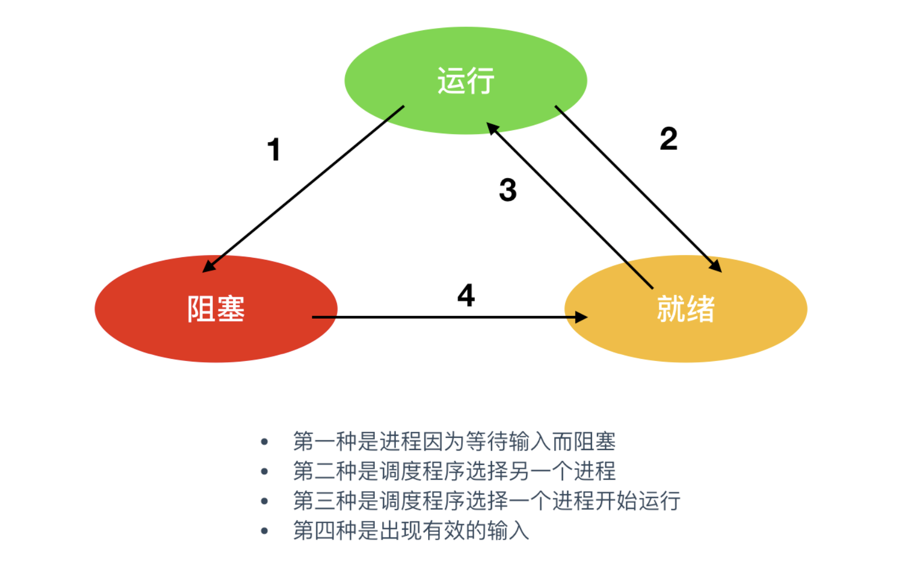
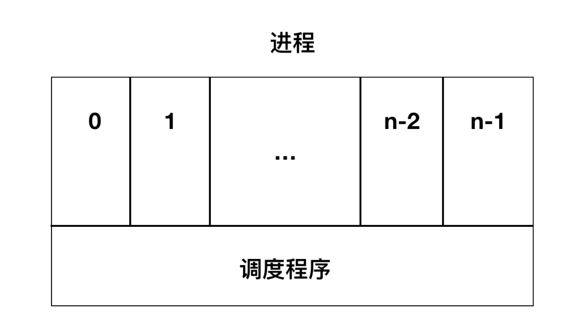

####  进程状态

对于操作系统来说，每个进程都是一个独立的实体，有其自己的程序计数器和内部状态，但是，进程之间也需要相互帮助。例如，一个进程的输出可以作为另一个进程的输入，在shell命令中

```bash
cat file1 file2 file3 | grep tree
```

在上面的这条命令中，第一个进程是`cat`，这个进程用于将三个文件的内容级联并输出。第二个进程是`grep`，它从输入中选择具有包含关键字`tree`的内容，根据这两个进程的相对速度(取决于两个进程的相对复杂度和各自进程所分配到的CPU时间片)，因此，该命令执行时可能会发生下面的情况，`grep`程序已经处于准备就绪开始执行的状态，但输入进程还没有完成，于是必须阻塞`grep`进程，直到输入完毕。

当一个进程开始运行时，可能会经历下面这几种状态



如上图为进程件的状态切换图，图中会涉及3种状态：

- `运行态`：运行态指进程实际占用CPU时间片的运行时间

- `就绪态`： 就绪态指进程可运行，但因为其他进程正在运行而处于就绪状态
- `阻塞态`：除非某种外部事件发生，否则程序不能运行

逻辑上来说，`运行态`和`就绪态`是很相似的。这两种状态都表明进程`可运行`，但是`就绪态`没有获得CPU时间分片。`阻塞态`与前两种状态不同的原因是处于阻塞态的进程无法运行，CPU空闲时也不能运行。

三种状态会涉及四种状态间的切换，在操作系统发现进程不能继续执行时会发生`状态1(从运行态转化为阻塞态)`的轮转，在某些系统中进程执行系统调用，例如，`pause`来获取一个阻塞的状态。在UNIX中，`当进程从管道或特殊文件(终端)中读取没有可用的输入时，该进程会被自动终止。`

`转换2(从就绪态转化为运行态)`和`转换3(从运行态转化为就绪态)`都是由进程调度程序引起的，进程本身不知道调度程序的存在。`转换2`说明进程调度器认定当前进程已经运行了足够长的时间，是时候让其他进程运行CPU时间片了。当所有其他进程运行过后，这时候进程调度器又会将CPU时间片分配给之前的进程，让其处于运行状态(转换3)。

> 程序调度：指根据程序调度器决定那个进程先运行，运行多久(多少CPU时间片)

当进程等待的过程中如果出现外部事件(例如，接收到了来自终端的输入)，则发生`转换4(从阻塞态转化为就绪态)`。如果此时没有其他进程在运行，则立刻触发`转换3`，该进程便开始运行，否则该进程会处于就绪状态，等CPU空闲后再轮到它运行。

基于进程的操作系统中最底层的是`中断`和`调度处理`，在该层之上则是`顺序进程`



操作系统最底层的程序就是调度程序，在调度程序层上分布许多进程。所有关于中断处理、启动进程和停止进程的具体细节都隐藏在调度程序里。

