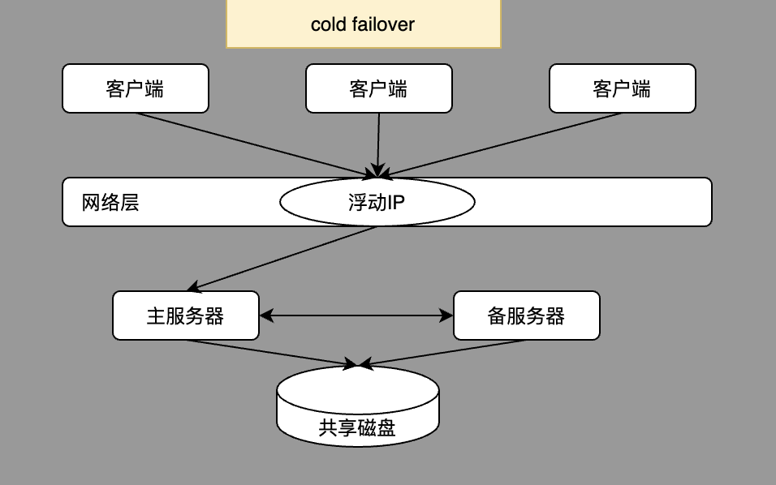
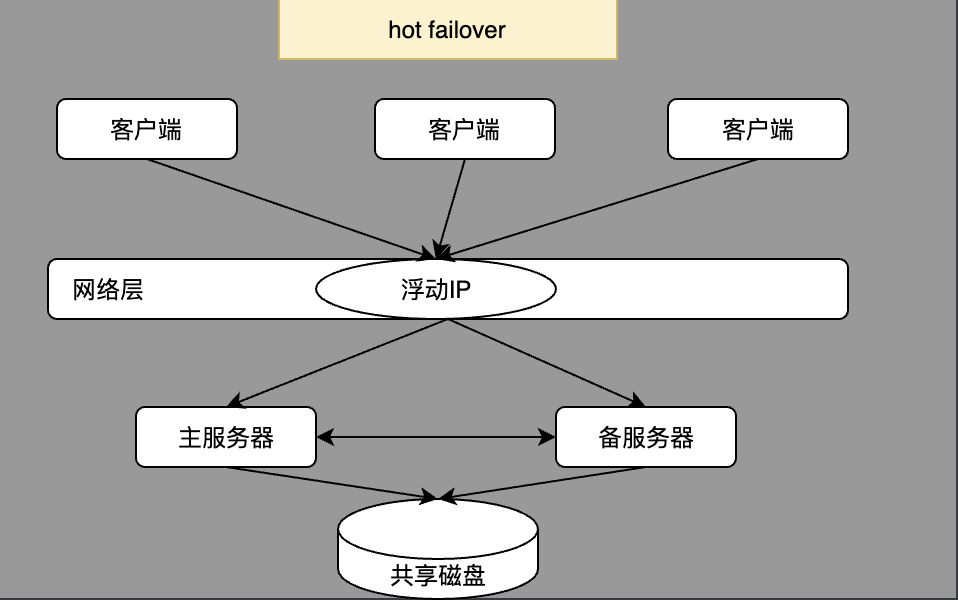
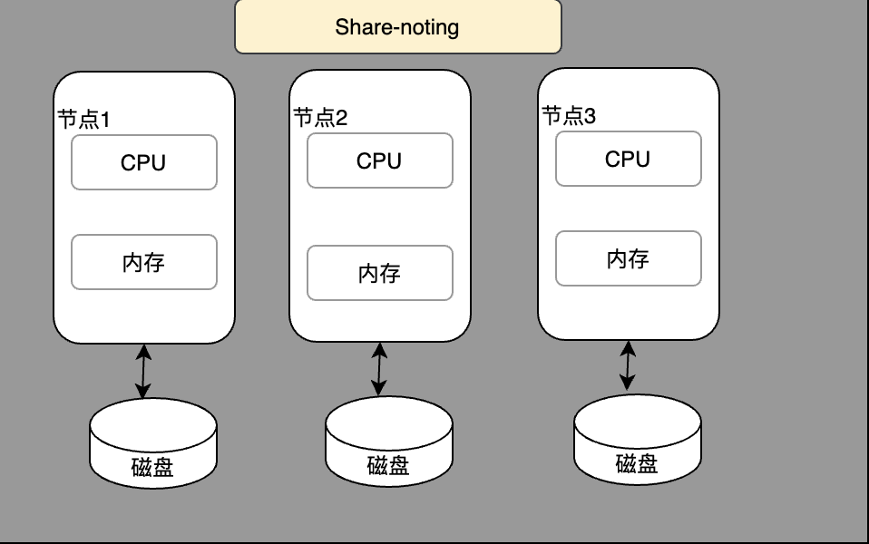
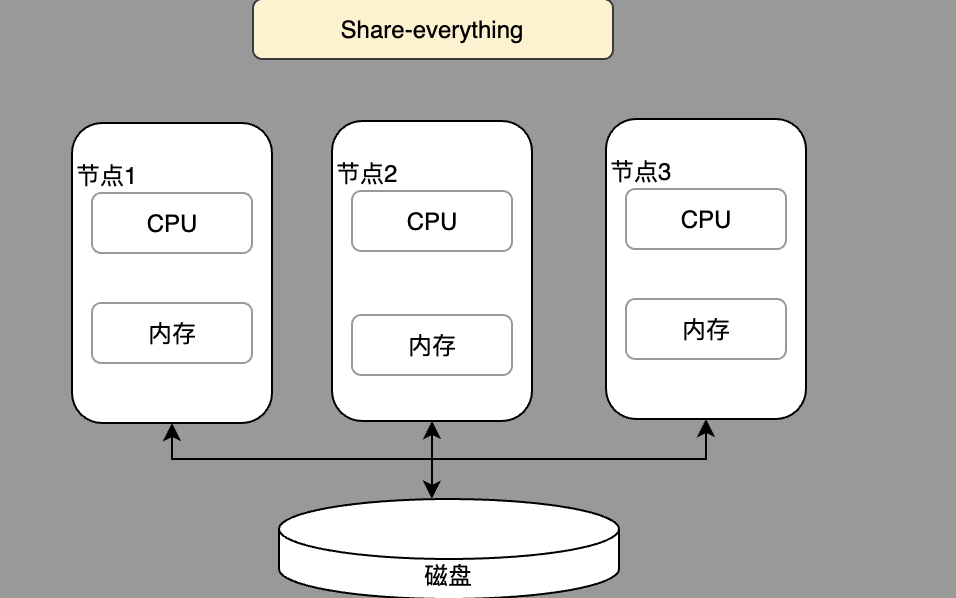

### 集群技术介绍

简单来说，集群是一组相互独立、通过高速网络互联的计算机，这些计算机通常被称为 **节点**，多个节点间通过单一模式进行管理，并能够同时向外提供统一服务的结构。集群中的每个节点间，可以彼此进行通信。从用户的角度来看，集群类似于一台单独的服务器。

根据集群的功能进行划分，可以将集群分为以下3种类别
* 高可用集群
* 负载均衡集群
* 高性能计算集群

#### 高可用集群

`高可用集群(High Availability Cluster)` 指可以最大程度上可以对外提供应用服务的集群，其中最主要功能的在于为应用程序持久、不间断的提供服务。
`高可用集群` 按照使用场景又分为 `cold failover` 和 `hot failover`。  
`cold failover` 被称为 **主/备模式**，指的是集群中的多台服务中存在一个 *主节点(master)* 向外提供服务, 另有一个或多个 *备用节点(slvae)*，当主节点无法向外提供服务时，集群的应用服务会从 *主节点* 切换到 *备用节点*，以此保证应用服务的不间断性。`主/备节点` 共享集群中的所有资源，以便能够实现应用服务的一致性和快速切换。
对于数据库应用，`cold failover` 模式通常通过 *主/备节点* 间的网络心跳来维护集群一致性，同时，`cold failover` 提供的浮动IP可以保证集群中应用程序服务的透明性。

高可用集群中的另一种模式为 `hot failover`, 这种模式下集群中的每个节点都处于活动态，每个节点都可以提供应用程序对外的访问。当集群中的一个节点发生故障时，其他节点可以承接故障节点的应用程序服务，而这些变化对集群应用来说全部是透明的。


#### 负载均衡集群

`负载均衡集群` 通常是由两台(或两台以上)的服务器组成的集群结构，该类型的集群中将节点类型分为 `前端负载调度` 和 `后端服务` 两个部分。
`负载调度` 节点负责将客户端的请求按照不同的策略分配给后端节点；`后端服务` 节点则是真正提供应用程序的部分，主要职责是对前端调度节点分配的任务进行处理。
在负载均衡集群中，所有负责任务处理的 `后端服务` 节点都处于活动态，它们都提供对外的服务，从而分摊应用系统的负载。
主要功能：
* 分摊应用服务负载
* 保障不间断的集群服务
* 主要应用为Web产品及数据库服务等产品

#### 高性能计算集群

`高性能计算集群` 能够提供单个计算机无法提供的强大计算能力，主要用来进行大规模的数据量计算并且倾向于追求集群的综合性能。从总体上来看，高性能计算集群类似于一个虚拟的超级计算机，这台计算机可以进行庞大而且高速的计算工作。而这些计算功能是一台普通计算所无法完成的。通常，高性能计算集群普遍使用 **并行技术** 来实现数据的计算。
主要功能：
* 提供高速计算

#### Share-nothing
`Share-noting` 这种结构下，集群中的每台节点都是一个独立的个体，节点与节点间的依赖关系降到最低。每个节点使用独立的资源，应用程序的负载也会分派在集群的不同节点上。这种结构的好处在于集群的结构简单，最大程度的减少了节点与节点之间的交互和依赖，而且避免了动态锁管理及多节点并发控制产生的性能瓶颈。
同时，`share-noting` 结构也具有很大程度上的弊端。由于集群节点间彼此资源的独立，当集群中的某个节点发生故障后，可能会导致数据无法访问；集群节点间数据镜像的成本比较高， 且节点间的可伸缩性和可扩展性比较差。


#### Share-everything
`Share-everything` 这种结构和 `Share-noting` 结构正好相反，这类集群中所有节点会访问共享的资源，这种架构也被称为 **共享磁盘架构**，最大的特点在于通过高速的存储局域网将多个节点连接在一起，实现对共享磁盘的并发读、写操作。这种架构集群能够实现非常好的高可用性、负载均衡、可测量性和扩展性。
但是，因为 `Share-everything` 架构中所有节点会向相同的磁盘中进行并发读、写操作，需要一套完善的控制机制来对读、写进行一定程度的串行化，从而解决并发读、写操作下的冲突并保证数据的一致性。

